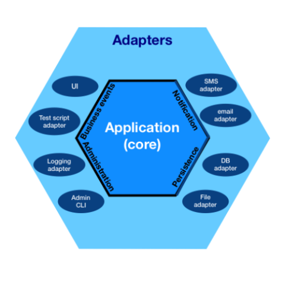

# **Hexagonal Order Management System**


Welcome to the **Hexagonal Order Management System** project! 🎉 This repository demonstrates how to design and build a backend system for managing orders using **Hexagonal Architecture**, **Domain-Driven Design (DDD)**, and a **microservices-based approach**.

This project is intended as an educational resource for developers looking to understand modern backend architecture principles while keeping the implementation approachable and practical.

---

## **About This Project**
The goal of this project is to:
- Demonstrate how to implement **Hexagonal Architecture** in a real-world system.
- Show how **Domain-Driven Design (DDD)** helps structure services around business logic.
- Implement a simple **Event-Driven Architecture** for communication between microservices.
- Provide insights into building maintainable, testable, and scalable microservices.

This project focuses on a simplified **Order Management System (OMS)** with the following services:
1. **Order Service**: Manages customer orders.
2. **Inventory Service**: Tracks and updates product inventory.
3. **Payment Service**: Handles payments and coordinates with the Order Service.


---

## **Why Hexagonal Architecture?**
Hexagonal Architecture (also known as **Ports and Adapters**) ensures:
1. **Separation of Concerns**:
    - The business logic is isolated from infrastructure details like databases, APIs, and messaging systems.
2. **Testability**:
    - With dependencies externalized, you can test the core logic independently.
3. **Flexibility**:
    - Adapters (e.g., REST APIs, databases) can be swapped without affecting the core business logic.

By applying Hexagonal Architecture, each microservice is designed to be:
- **Independent**: Focused on a single domain.
- **Scalable**: Can grow independently of other services.
- **Maintainable**: Easy to adapt to future changes.

---

## **Tech Stack**
Here’s what powers this project:

### **Language**
- **Java 17**: Reliable, performant, and widely used for backend systems.

### **Framework**
- **Spring Boot 3.x**: Simplifies microservices development with built-in support for REST, messaging, and dependency injection.

### **Event-Driven Communication**
- **Apache Kafka**: Enables reliable and asynchronous communication between microservices.

### **Containerization**
- **Docker Compose**: Provides a local development environment where services can run in isolated containers.

### **Database**
- **PostgreSQL**: A powerful relational database for storing persistent data.

### **Testing**
- **JUnit 5**: For unit and integration testing.
- **Testcontainers**: To simulate database and Kafka environments during testing.

---

## **Project Structure**
Each microservice follows the **Hexagonal Architecture** pattern and is structured as follows:

```plaintext
src/
  ├── application/   // Application use cases (orchestration of business logic)
  ├── domain/        // Core business logic: entities, value objects, and domain services
  ├── infrastructure/ 
      ├── repository/  // Database-specific implementations
      ├── api/         // REST endpoints or gRPC definitions
      ├── messaging/   // Kafka consumers/producers
  ├── adapter/
      ├── input/       // REST controllers, CLI, or event handlers
      ├── output/      // External systems like databases, Kafka, etc.
```

For educational purposes, the **monorepo** structure has been chosen for this project. This approach offers several advantages:

- **Centralized management**: Easier to handle changes that span across multiple services.
- **Simplicity**: Ideal for small-scale or educational projects where collaboration and exploration are key.

However, in a real-world production environment, a **multi-repo** setup would often be more appropriate:

- **Closer to industry practices**: Reflects the way services are typically managed in large organizations.
- **Better service isolation**: Each service is entirely independent, making it easier to scale, secure, and manage individually.

```plaintext
Hexagonal-Order-Management-System/
├── order-service/         # Spring Boot project for order management
│   ├── src/               # Source code for the service
│   ├── pom.xml            # Maven service configuration 
│   ├── Dockerfile         # Docker configuration for the service
│   ├── README.md          # Service-specific documentation
│
├── inventory-service/     # Spring Boot project for inventory management
│   ├── src/
│   ├── pom.xml
│   ├── Dockerfile
│   ├── README.md
│
├── payment-service/       # Spring Boot project for payment processing
│   ├── src/
│   ├── pom.xml
│   ├── Dockerfile
│   ├── README.md
│
├── docker-compose.yml     # Docker Compose configuration for running all services
├── README.md              # Documentation for the entire project
├── .gitignore             # Excludes files from version control
└── pom.xml                # Maven parent configuration
```

### **Example: Order Service**
- **Application Layer**:
    - Handles use cases like `createOrder()` or `getOrderDetails()`.
- **Domain Layer**:
    - Defines the `Order` entity and domain-specific rules (e.g., order must have at least one item).
- **Infrastructure Layer**:
    - Implements persistence using PostgreSQL and communicates with Kafka.

---

## **How to Run**
### **Prerequisites**
- Docker and Docker Compose installed on your system.
- JDK 17+ installed locally (for development).

### **Steps**
1. Clone this repository:
   ```bash
   git clone https://github.com/KitanoB/Hexagonal-Order-Management-System.git
   cd Hexagonal-Order-Management-System
   ```
2. Start the services using Docker Compose:
   ```bash
   docker-compose up --build
   ```
3. Access the services via:
    - `Order Service`: `http://localhost:8080/orders`
    - `Inventory Service`: `http://localhost:8081/inventory`
    - `Payment Service`: `http://localhost:8082/payments`

---

## **Key Concepts Explained**
### **Hexagonal Architecture**
- **Ports**: Abstract interfaces that define how the application interacts with the outside world.
- **Adapters**: Concrete implementations of ports, such as REST APIs or database connections.

### **Domain-Driven Design (DDD)**
- Focuses on understanding the **business domain** and creating models that reflect it.
- Promotes clarity and communication between developers and domain experts.

### **Event-Driven Architecture**
- Services communicate asynchronously by emitting and consuming events via Kafka.
- This decouples services, making them more resilient and scalable.

---

## **Next Steps**
1. **Documentation**: Dive deeper into Hexagonal Architecture, DDD, and Event-Driven principles in the `/docs` folder.
2. **Contributions**: Open for pull requests! Share ideas or improvements.
3. **Issues**: If you encounter any problems, please report them under the Issues tab.

---

## **License**
This project is licensed under the MIT License. See `LICENSE` for details.

---

This README should give your project a professional yet accessible feel, providing clear guidance and educational value to developers. Let me know if you need help refining it further!